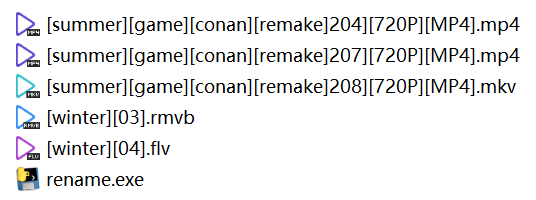
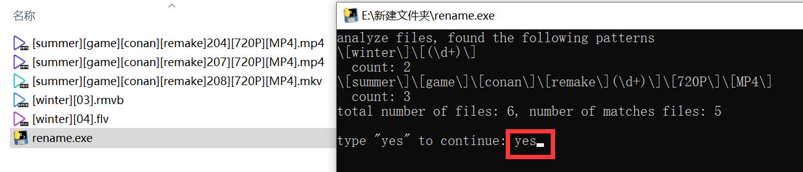

# File-Name-Cleaner

## Description
Downloaded files, such as videos, are often with verbose infomation. This script can clean the file names, reserve only useful infomation automatically. 

## Usage

Download and move rename.exe to the target directory.

Double-click rename.exe, and the program will show you the analyzed patterns (as a regular expression).

Ensure that the patterns are what you want, and type "yes" to continue.

Enter to run the renaming program, then all file names are cleaned.

