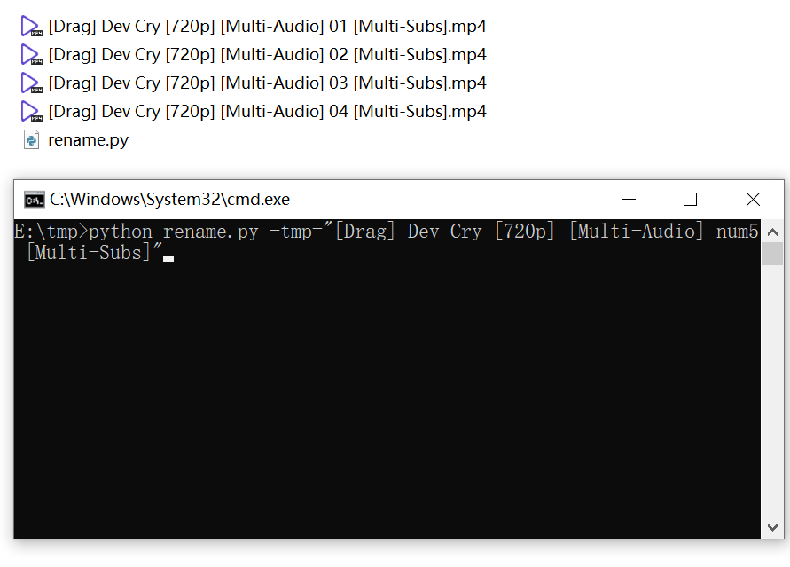
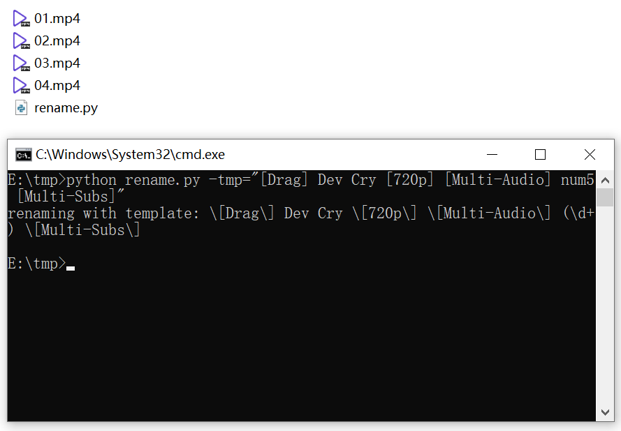

# Clean-File-Name

## Description
Downloaded files, such as videos, are often with verbose infomation. This script can clean the file names, reserve only useful infomation automatically. 

You just give the file name (without file extension) template as argument -tmp, replace the video number as "**num5**". 

## Example
Given a file with name 
```
[Drag] Dev Cry [720p] [Multi-Audio] 09 [Multi-Subs].mp4
``` 
you just 
move rename.py to the directory and enter
```bash
python rename.py -tmp="[Drag] Dev Cry [720p] [Multi-Audio] num5 [Multi-Subs]"
``` 
Then, also files matching such a template are automatically renamed.

### Before Renaming

### After Renaming

